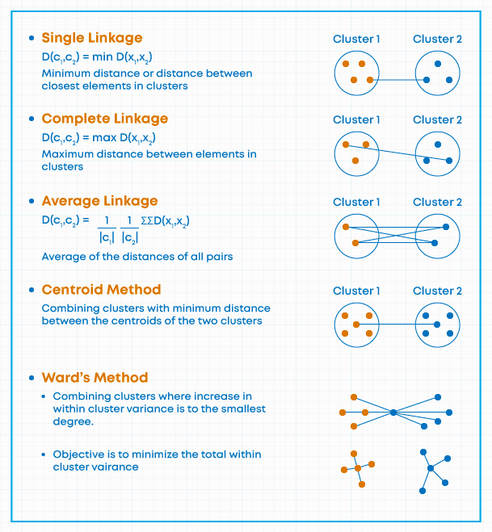

# Flujos de trabajo de Minería de datos y técnicas de preprocesamiento

## Definiendo Minería de datos

A continuación se presentan tres definiciones fundamentales de la disciplina:

1. **Enfoque de Proceso KDD**: La minería de datos es una etapa específica dentro del proceso de Descubrimiento de Conocimiento en Bases de Datos (KDD) que consiste en la aplicación de algoritmos de análisis y descubrimiento que producen una enumeración de patrones sobre los datos [@fayyad1996].

2. **Enfoque de Descubrimiento de Conocimiento**: Se define como el proceso de descubrir patrones interesantes y conocimiento a partir de grandes cantidades de datos almacenados en bases de datos, almacenes de datos (data warehouses) u otros depósitos de información [@han2011].

3. **Enfoque Estadístico**: Es el análisis de conjuntos de datos observacionales (frecuentemente grandes) con el fin de encontrar relaciones insospechadas y resumir los datos de formas novedosas que sean tanto comprensibles como útiles para el propietario de los mismos [@hand2001].

### Motivación para la Minería de datos

  * (*Variedad*) Los métodos de recolección de datos han evolucionado muy rápidamente.
  * (*Volumen*) Las bases de datos han crecido exponencialmente
  * (*Usuarios*) Estos datos contienen información útil para las empresas, países, etc.
  * (*Tecnología*) El tamaño hace que la inspección manual sea casi imposible
  * (*Método*) Se requieren métodos de análisis de datos automáticos para optimizar el uso de estos enormes conjuntos de datos

## Flujos de Trabajo

La estructuración de proyectos de minería de datos se rige por marcos metodológicos que aseguran la replicabilidad y calidad del conocimiento extraído.

### KDD (Knowledge Discovery in Databases)

* **Origen**: Propuesto por @fayyad1996 en el ámbito académico para distinguir el proceso global de descubrimiento de la etapa específica de aplicación de algoritmos.
* **Fases**: 1. Selección, 2. Preprocesamiento, 3. Transformación, 4. Minería de datos, 5. Interpretación/Evaluación.
* **Enfoque**: Científico y centrado en la purificación técnica de los datos.

### CRISP-DM (Cross-Industry Standard Process for Data Mining)

* **Origen**: Surgió de un consorcio europeo a finales de los 90 (NCR, SPSS, Daimler-Benz) para crear un estándar no propietario adaptado a la industria [@chapman2000].
* **Fases**: 1. Comprensión del Negocio, 2. Comprensión de los Datos, 3. Preparación de los Datos, 4. Modelado, 5. Evaluación, 6. Despliegue.
* **Enfoque**: Cíclico e iterativo, priorizando los objetivos del negocio.

### SEMMA

* **Origen**: Desarrollado por el SAS Institute como metodología operativa para su software Enterprise Miner [@matignon2007].
* **Fases**: 1. Sample (Muestreo), 2. Explore (Exploración), 3. Modify (Modificación), 4. Model (Modelado), 5. Assess (Evaluación).
* **Enfoque**: Técnico-estadístico, orientado a la experimentación en laboratorio.

### OSEMN

* **Origen**: Acuñado por @mason2010 para simplificar el flujo de trabajo en la ciencia de datos moderna basada en scripts (R/Python).
* **Fases**: 1. Obtain (Obtener), 2. Scrub (Limpiar), 3. Explore (Explorar), 4. Model (Modelar), 5. iNterpret (Interpretar).
* **Enfoque**: Pragmático y ágil, ideal para entornos de desarrollo rápido y programación fluida.

| Característica | KDD | CRISP-DM | SEMMA | OSEMN |
| :--- | :--- | :--- | :--- | :--- |
| **Autor / Referencia** | @fayyad1996 | @chapman2000 | @matignon2007 | @mason2010 |
| **Origen** | Academia (Ciencias de la Computación) | Consorcio Industrial (NCR, SPSS, Daimler) | Sector Software (SAS Institute) | Ciencia de Datos Moderna (Agile) |
| **Enfoque Principal** | Proceso científico de extracción de conocimiento. | Integración de los objetivos de negocio. | Experimentación técnica y estadística. | Programación ágil y flujo de código. |
| **Fases Clave** | Selección, Preprocesamiento, Transformación, Minería, Interpretación. | Negocio, Datos, Preparación, Modelado, Evaluación, Despliegue. | Sample, Explore, Modify, Model, Assess. | Obtain, Scrub, Explore, Model, iNterpret. |
| **Uso Ideal** | Investigación y desarrollo (I+D). | Gestión de proyectos corporativos. | Análisis en laboratorios estadísticos. | Prototipado rápido en R o Python. |

> Actividad 1: El Dilema de la Metodología (Análisis Crítico)

**Instrucción:** Analice los siguientes dos escenarios y asigne la metodología que considere más adecuada. Posteriormente, identifique una "falla o limitación" de esa metodología para ese caso específico.

1. **Escenario A:** Una institución bancaria requiere un modelo de riesgo crediticio altamente auditable por entes reguladores, donde cada paso de la transformación de datos debe estar documentado estadísticamente.
2. **Escenario B:** Un equipo de marketing digital necesita probar rápidamente si un nuevo algoritmo de recomendación mejora los clics en una campaña que dura solo 48 horas.

**Guía de respuesta para el estudiante:**
* Escenario A: [Metodología sugerida entre CRISP-DM o SEMMA].
* Crítica: ¿Qué aspecto de esta metodología podría retrasar el proyecto?
* Escenario B: [Metodología sugerida entre KDD o OSEMN].
* Crítica: ¿Qué riesgo se corre al priorizar la velocidad sobre el rigor?

> Actividad 2: Ingeniería Inversa de Procesos (Diferenciación)

**Instrucción:** Se presenta una lista de 4 acciones clave realizadas en un proyecto de análisis de sentimientos. Clasifique cada acción según el flujo de trabajo indicado.

| Acción Realizada | Fase en CRISP-DM | Fase en OSEMN |
| :--- | :--- | :--- |
| Definir que el éxito es reducir las quejas en un 20%. | | |
| Eliminar emojis y stop-words de los tweets. | | |
| Ejecutar un análisis exploratorio para ver palabras frecuentes. | | |
| Presentar una gráfica de barras con los resultados al director. | | |

**Pregunta de reflexión:** ¿Por qué el flujo de @mason2010 es más natural para un analista que trabaja solo, mientras que el de @chapman2000 es indispensable para un equipo que trabaja para un cliente externo?

Lectura sugerida: https://ijisr.issr-journals.org/abstract.php?article=IJISR-14-281-04

## Conceptos básicos

- *Dataset*: Colección de datos para el análisis
    + Estructurado: Formato tabular (filas y columnas)
    + No estructurado: Audios, imágenes, texto, video, ondas, etc. 
- Métodos de minería de datos
  * Pre procesamiento: Son métodos previos al modelado central; Agrupamiento, Componentes principales (reducción de variables)
    + Agrupamiento: Crear grupos a partir de las similitudes de las variables
    + Componentes principales (reducción de variables): Se crean variables nuevas (componentes) y se trabaja con las principales
  * Predictivos: Son métodos que buscan *predecir*

$$ X \rightarrow Y \quad Y_{t} \rightarrow Y_{t+1}$$

  * Asociación: Trabajan con dataset de *transacciones*, su objetivo es identificar reglas de asociación "*fuertes*"

- *Analítica de datos*
  + Descriptiva
  + Exploratoria: Agrupamiento, componentes principales, correspondencia
  + Predictiva: Clasificación, asociación, regresión
  + Prescriptiva
- *Almacén de datos* (data warehouse)
  + ETL, ELT

## Importación de datos

Se refiere al proceso de cargar/definir el dataset.

- *Fuente de datos*: Origen de los datos
- *Formato de los datos*: Extensión de los archivos

### Pasos iniciales
  
  - Tipo de dataset
  - Tamaño del dataset: Filas y columnas
  - Tipos de atributo/variables (formato/clase)
  - Exploración inicial
  - Record linkage (enlace entre registros)

## Limpieza y depuración

- Ordenamiento de los datos 
- Adecuación de formatos
  + Numérico
  + Cadena/texto
  + Lógico
  + Factor (nominal, ordinal)
  + Fechas (lubridate)
- Limpieza de texto
  + Mayúscula/minúscula
  + Espacios en blanco
  + Ortografía
  + Errores de transcripción
  + Extracción/reemplazo

### Transformación

- Agregación 
- Selección (columnas/variables) y filtrado (filas/unidades)
- Creación de variables (mutate)
- Binarización (0/1 F/T)
- Discretización (cut, quantile)
- Estandarización
  
$$z=\frac{x-\bar{x}}{\sigma}$$  
  - Normalización Max/min (0 - 1)
  
$$y=\frac{x-min_x}{max_x-min_x}$$

## Exploración de datos

Se refiere al proceso de descubrir, conocer el dataset.

+ Estadísticas descriptivas
+ Inferencia descriptiva
+ Visualización

```{r, eval=FALSE}
rm(list=ls())
library(ExPanDaR)#dashboard shiny
library(GGally)# ggplot
```

### Exploración y calidad de los datos

- Errores en la recolección 
- Falta de calibración de los instrumentos de medición
- Precisión, sesgo y exactitud
- Valores inconsistentes
- Observaciones duplicadas
- Valores atípicos
- Valores perdidos (no confundir con los valores de no aplica)

## Reducción de dimensionalidad: Componentes principales

$$S_y^2=\frac{\sum (y_i-\bar{y})^2}{n-1}$$

$$S_{xy}=\frac{\sum (y_i-\bar{y})(x_i-\bar{x})}{n-1}$$

$$\rho_{xy}=\frac{S_{xy}}{S_x S_y}\quad -1\leq \rho_{xy} \leq1$$

El método de Análisis de Componentes Principales se ocupa de explicar la estructura de varianza y covarianza de un grupo de variables a través de unas pocas combinaciones lineales de este grupo de variables. En general sus objetivos son (1) la *reducción de los datos* y (2) la *interpretación*.

Algebráicamente, los componentes principales son combinaciones lineales de $p$ variables aleatorias $X_1$, $X_2$, \ldots, $X_p$. Geométricamente, estas combinaciones lineales representan la selección de un nuevo sistema de coordenadas obtenido por rotación de del sistema original con $X_1$, $X_2$, \ldots, $X_p$ como los ejes de coordenadas. Los nuevos ejes representan la dirección con la máxima variabilidad y provee una simple y más parsimoniosa descripción de la estructura de la covarianza.

Los componentes principales dependen únicamente de la matriz de covarianza $\Sigma$ o la matriz de correlaciones $\rho$ (Matriz estandarizada de $\Sigma$) de $X_1$, $X_2$, \ldots, $X_p$. Su desarrollo no requiere de ningún supuesto de normalidad multivariada, sin embargo, componentes principales derivados de poblaciones normales multivariantes tienen un gran uso en la interpretación en términos de elipsoide de densidad constante.

Sea la matriz $\mathbf{X}$ compuesta de $p$ vectores aleatorios $\mathbf{X}=[X_1, X_2, \ldots, X_p ]$ que tiene la matriz de covarianza $\Sigma$ con valores propios $\lambda_1 \geq \lambda_2 \geq \ldots \geq \lambda_p \geq 0$.

Considere la combinación lineal:

$$
\begin{array}{rrr}
Y_1		= & a_1^{'} \mathbf{X} = & a_{11} X_1 + a_{12} X_2 + \ldots a_{1p} X_p \\
Y_2		= & a_2^{'} \mathbf{X} = & a_{21} X_1 + a_{22} X_2 + \ldots a_{2p} X_p\\
\vdots	= & \vdots & \vdots \\
Y_p		= & a_p^{'} \mathbf{X} = & a_{p1} X_1 + a_{p2} X_2 + \ldots a_{pp} X_p\\
\end{array}
$$
Equivalente a:

$$
\mathbf{Y}= \left[  
\begin{array}{c}
Y_1\\
Y_2\\
\vdots\\
Y_p\\
\end{array}
\right] = \left[  
\begin{array}{cccc}
a_{11} & a_{12} & \ldots & a_{1p} \\
a_{21} & a_{22} & \ldots & a_{2p} \\
\vdots & \vdots & \ddots & \vdots \\
a_{21} & a_{p2} & \ldots & a_{pp} \\
\end{array}
\right] \left[ 
\begin{array}{c}
X_1\\
X_2\\
\vdots\\
X_p\\
\end{array}
\right] = \mathbf{A X}
$$

La combinación lineal $\mathbf{Y}=\mathbf{AX}$ tiene:

$$
\mu_y=E(\mathbf{Y})=E(\mathbf{AX})=A \mu_x
$$

$$
\Sigma_y=Cov(\mathbf{Y})=Cov(\mathbf{AX})=A \Sigma_x A^{'}
$$

En base a lo anterior, se obtiene:

$$
Var(Y_i)=a_{i ,(1xp)}^{'} \Sigma_{x,(pxp)} a_{i, (px1)} \quad i=1, 2, \ldots, p
$$

$$
Cov(Y_i,Y_k)=a_i^{'} \Sigma_x a_k \quad i,k=1, 2, \ldots, p
$$

Los componentes principales son combinaciones lineales incorrelacionadas, tal que \ref{cp5} es lo más grande posible.

El primer componente principal es la combinación lineal con máxima varianza. Entonces se debe maximizar $Var(Y_1)=a_1^{'} \Sigma a_1$. Es claro que $Var(Y_1)$ puede ser incrementada multiplicando a $a_1$ por alguna constante. Para eliminar esta indeterminación, es conveniente restringir los coeficientes del vector. Por lo tanto se define.

$$
\begin{array}{rcl}
\text{Primer componente principal} & = & \text{Combinacion lineal} \quad a_1^{'}X \quad \text{que maximiza} \\
								   &   & Var(a_1^{'}X) \quad \text{sujeto a} \quad a_1^{'} a_1=1\\
\text{Segundo componente principal} & = & \text{Combinacion lineal} \quad a_2^{'}X \quad \text{que maximiza} \\
								   &   & Var(a_2^{'}X) \quad \text{sujeto a} \quad a_2^{'} a_2=1 \quad y \\													   &   & Cov(a_1^{'}X,a_2^{'}X)=0			   
\end{array}
$$
 
Para el $i-esimo$ paso:

$$
\begin{array}{rcl}
i-esimo \text{ componente principal} & = & \text{Combinacion lineal} \quad a_i^{'}X \quad \text{que maximiza} \\
								   &   & Var(a_i^{'}X) \quad \text{sujeto a} \quad a_i^{'} a_i=1 \quad y \\													   &   & Cov(a_i^{'}X,a_k^{'}X)=0 \quad	para \quad k<i			   
\end{array}
$$

$$\Sigma_{(pxp)}= A_{(p*p)} \Lambda_{(p*p)} A^t_{(p*p)} $$

El aspecto central de componentes principales es trabajar con menos variables, sea $m<p$, el método de componentes busca a partir de $m$, los siguiente:

$$\Sigma_{(pxp)} \approx  A_{(p*m)} \Lambda_{(m*m)} A^t_{(m*p)}$$
Los pasos sugeridos para iniciar el análisis de componentes principales son:

1. *Identificar las variables* de interés dentro de la matriz de datos, si las variables tienen las *mismas escalas* se recomienda emplear la matriz de *covarianza*, si las escalas son *diferentes*, se recomienda trabajar con la matriz de *correlaciones*.
2. Obtener los componentes principales, los *eigen valores* y la matriz de *eigen vectores*
3. (Opcional) Eliminar las variables redundantes, 
  * se sugiere identificar las variables del conjunto de datos correlacionadas con los últimos componentes.
4. (Opcional) Calcular nuevamente los componentes principales excluyendo las variables identificadas en el paso previo
5. Elegir el *número de componentes a retener* $m$ (scree plot, tamaño de los eigen valores, etc)
6. Analizar los resultados y usar los componentes

Usos de componentes principales.

* Detección de valores atípicos
* Identificación de posibles factores 
* Los primeros componentes se pueden usar como indicadores
* Eliminan la multicolinealidad de un modelo de regresión múltiple

$$V(Y_1)=\lambda_1$$
$$Y_1=a_{11} X_1+a_{21}X_2+\ldots + a_{p1}X_p $$

## Clustering, Agrupamiento

El clustering es un método cuyo objetivo es el de *crear grupos* en base a las relaciones *multivariantes* que existen en los datos, este método es un método previo a las técnicas de "*clasificación*" que existen. La base del clustering es la definición de la **similaridad entre las filas**. Similaridad es definida como una función de distancia entre un par de filas.

Es importante distinguir la existencia de grupos *naturales* dentro de los datos, normalmente estos grupos son características naturales de las observaciones de interés. 

Ejemplo de aplicación

+ En las escuelas o universidades, con base a las notas se puede tener grupos. Esto puede servir para estrategias de apoyo. 
+ En la banca se pueden crear grupos basados en las características de los clientes de créditos/ahorro. Esto puede servir para mejorar servicios o incrementar personal.
+ En los hospitales sobre la base de datos de pacientes, para tener perfil de los pacientes...

### Medidas de (Di)similaridad

Dado el objetivo del clustering, el aspecto mas importante dentro de estos métodos es utilizar de forma correcta la *medida* de (*di*)*similaridad* para los casos dentro de la base de datos.

La definición de las *medidas de distancia* es *crucial* para aplicar estos modelos. Funciones de distancia incorrecta pueden generar sesgos en los resultados y ser un problema para etapas posteriores de la mineria de datos. Debemos distinguir las funciones de distancia según la **naturaleza de las variables**.

Sean las filas $x$ e $y$ dentro de una base de datos, estos vectores tienen una dimensión $p$, es decir, se observan $p$ variables para las 2 observaciones.

**Distancia Euclideana**: Variables numéricas

$$d(x,y)=\sqrt{\sum_{i=1}^p{(x_i-y_i)^2}}$$

Donde los $x_i$ y $_y_i$ son los valores para la variable $i$ de las observaciones $x$ e $y$.

**Distancia Manhattan:** Variables numéricas, $p$ grande

$$d(x,y)=\sum_{i=1}^p{|x_i-y_i|}$$

**Distancia Minkowski:** Variables numéricas, $p$ grande 

$$d(x,y)=\left(\sum_{i=1}^p{|x_i-y_i|^d}\right)^{1/d}$$

Se recomienda que d sea cercano a 0 cuando p sea grande

#### Distancias para variables nominales (todas nominales)

En este caso la mejor estrategia es llevar las variables con sus categorías a variables *binarias*. Existen múltiples medidas de distancia para variables binarias, muchas de estas medidas son aproximaciones a las medidas mas conocidas. Entre ellas:

Sean las filas $i$, $j$ que contienen los valores binarios de las variables de estudio. Sea $A$ el total de $1$ que existe en $i$, $B$ el total de $1$ que existe en $j$ y sea $J$ el total de casos en los que los $1$ ocurren simultaneamente en $i$ y $j$.

* Euclideana
  
$$d_{ij}=\sqrt{A+B-2J}$$
  
* Manhattan
  
$$d_{ij}=A+B-2J$$

* Bray
  
$$d_{ij}=\frac{A+B-2J}{A+B}$$

* Binomial
  
$$d_{ij}=log(2)(A+B-2J)$$

#### Distancias para variables mixtas (cuantitativas, nominales, ordinales)

Una de los mayores desafíos es cuando las variables son mixtas, es decir cuantitativas y cualitativas.

La mejor distancias para estos casos es la distancia de *Gower*.

$$d_{ij} = d(i,j) = \frac{\sum_{k=1}^p w_k \delta_{ij}^{(k)} d_{ij}^{(k)}}{
	  \sum_{k=1}^p w_k \delta_{ij}^{(k)}}$$

### Métodos de clustering

* Partición (k-center)
* Jerárquicos (dendograma)
* **Basados en densidad:** Identifican regiones de alta densidad de puntos en el espacio de datos; DBSCAN (Density-Based Spatial Clustering of Applications with Noise) y HDBSCAN (Hierarchical Density-Based Spatial Clustering of Applications with Noise).
* **Basados en cuadrículas (grid):** Dividen el espacio de datos en una cuadrícula de celdas regulares. Cada celda de la cuadrícula se considera un cluster potencial. El algoritmo cuenta el número de puntos en cada celda y luego identifica clusters como las celdas que contienen un número alto de puntos

### K-center Clustering (no jerárquicos)


#### Algoritmo

0. Definición del valor de $k$.
1. Partición de las observaciones en $k$ grupos (de forma aleatoria), obtener el vector de centros de cada grupo (centroides). Se puede trabajar con la media, la mediana o el medoide.
2. Para cada observación calcular las distancia euclidiana (u otra) a los centroides y reasignar la observación en base a la menor distancia, re calcular los centroides en base a la re asignación de cada observación
3. Repetir el paso 2 hasta que que ya no existan más re asignaciones

El valor de $k$ respecto el número de grupos ("cluster") puede ser definido con base a un criterio de utilidad propia o basado en un criterio estadístico. 

+ Utilidad: El investigador define el valor
+ Estadístico: Analizar la buena "pertenencia" a los grupos 

### Cluster Jerárquico

El objetivo es obtener una *jerarquía* de posibles soluciones que van desde un solo grupo a $n$ grupos, donde $n$ es el número de observaciones en el conjunto de datos.


#### Algoritmo

  1. Se inicia con $n$ grupos y se genera una matriz de $nxn$ de distancias, $D=\{d_{ik}\}$
  2. Buscar en la matriz de distancia los pares de cluster más cercanos entre ellos, *los cluster mas similares*, si definimos los clusters $V$ y $U$, estamos interesados en encontrar $d_{UV}$
  3. Unir los cluster $U$ y $V$, re etiquetar el nuevo cluster como $UV$. Actualizar la matriz de distancias a) remover las filas y columnas correspondientes a $U$ y $V$ b) incluimos las nuevas filas y columnas para el nuevo cluster $UV$.
  4. Repetimos el paso 2 y 3 un total de $n-1$ veces.

El momento de definir el cluster más cercano, se puede emplear los siguientes enlaces:

* Single linkage (enlace simple)
* Complete linkage (enlace completo)
* Average linkage (enlace promedio)
* Centroid method (Método del centroide)
* Ward's method (Método de Ward's)



> Nota: Se debe elegir la matriz de distancias acorde a la naturaleza de los datos, se recomienda:

* Todas Numéricas: Euclideana o Manhatan
* Todas nominales: Transformación a binarias y usar la distancia binomial
* Mixtas: Distancia de Gower

> Nota: El dendograma es muy útil para ver las relaciones que existen basadas en las distancias y la creación de las jerarquías, a partir de estos se puede definir un $k$ (de forma visual)

> Nota: El dendograma pierde su utilidad cuando la cantidad de observaciones es muy alta, 

### Validación cluster

* La estructura de los cluster es aleatoria (¿funciona?)
* ¿Cómo definimos el valor de $K$? 
  - Coeficiente de silueta
  - Método de Elbow (investigar)

#### Silhouette coefficient

$$s_i=\frac{b_i-a_i}{max(a_i,b_i)}$$

1. Se obtiene para la observación $i$ el promedio de distancia a todos los objetos en el mismo cluster ($a_i$)
2. Se obtiene para la observación $i$ el promedio de distancia a todos los objetos de los otros clusters ($b_i$)
3. Se define a $s_i$ como el coeficiente, con un recorrido entre $[-1,1]$, para cada observación $i$

Idealmente se espera que $a_i < b_i$ y los $a_i$ cercanos a $0$. 
